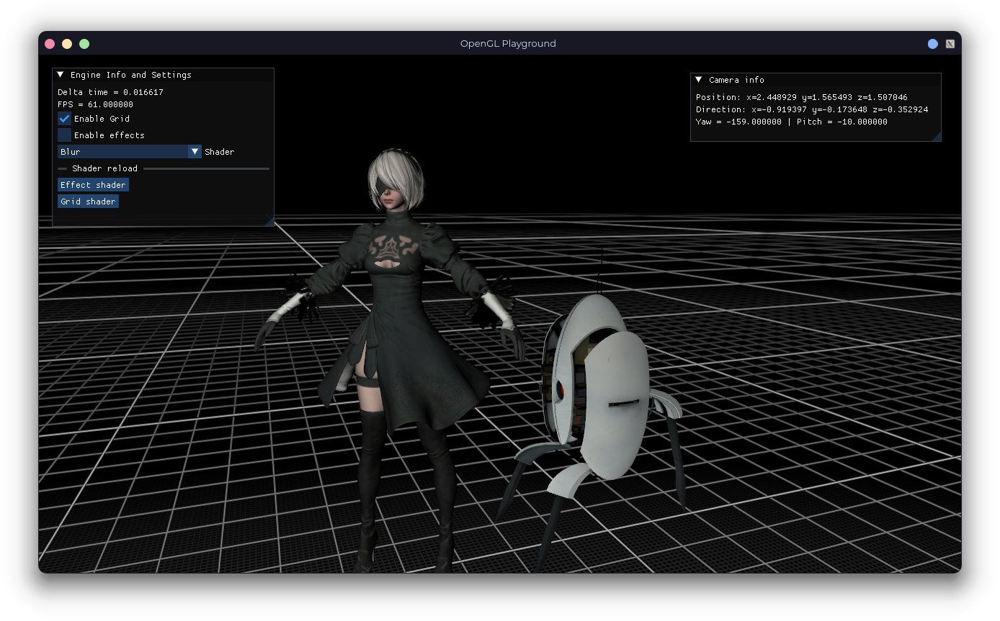

# OpenGL Playground

This is just a program to practice some OpenGL stuff.

And some other things that I wanted to do in my [Computer Graphics Final Project](https://github.com/Azrielx86/ProyectoFinal_CGeIHC) (but I hadn't enough time to do it 😿)

Work in progress!

>[!NOTE]
>Requires vcpkg to build on Windows.

## Things that I want to do

- [x] Multiple lights
- [ ] Lighing: Point and Spot
- [x] Normal mapping
- [ ] Parallax mapping
- [ ] Shadows
- [x] Using Framebuffers
- [ ] Bloom effect
- [ ] Motion Blur effect
- [ ] Fresnel effect
- [ ] SSAO
- [x] Grid floor
- [ ] Particle system

## Things that I added on the fly

- Framebuffer effects enable/disable and change.
- Shader reloading.
